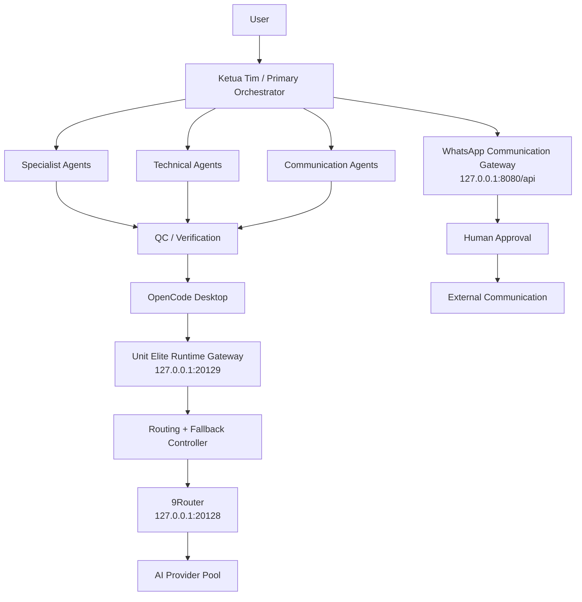

# Unit Elite

**Local-first multi-agent AI operations runtime for Windows.**

Unit Elite is a personal AI operations system built around **14 specialized agents**, a local runtime gateway, multi-provider routing and fallback, a WhatsApp communication bridge, human-in-the-loop controls, and portable deployment.

> Current focus: reliable local orchestration, controlled communications, recoverability, and portability across Windows machines.

---

## Highlights

- **14 specialized agents** coordinated through a primary orchestrator
- **Local runtime gateway** for model routing and request normalization
- **Multi-provider routing + fallback**
- **OpenCode Desktop integration**
- **WhatsApp communication gateway**
- **Human approval required before external dispatch**
- **Full-system control plane:** START / STATUS / STOP / RECOVER
- **Portable Windows deployment**
- **Encrypted credential migration**
- **Loopback-only internal services**
- **Health checks, bounded recovery, and process ownership safeguards**

---

## Architecture



---

## Agent System

Unit Elite currently uses 14 agents with separated responsibilities:

1. Ketua Tim
2. Analis Legal
3. Analis Dokumen
4. Analis Kebijakan
5. Juru Korespondensi
6. Juru Kebijakan
7. Paparan & Sambutan
8. Narahubung
9. Dispatcher Komunikasi
10. Verifikator / QC
11. Arsiparis
12. Pranata Komputer
13. Developer
14. UI Designer

Delegation is centralized through **Ketua Tim** so that production, technical escalation, quality control, and communication remain traceable.

---

## Runtime Flow

```text
OpenCode Desktop
      │
      ▼
Unit Elite Runtime Gateway
127.0.0.1:20129
      │
      ▼
Routing + Fallback Controller
      │
      ▼
9Router
127.0.0.1:20128
      │
      ▼
AI Provider Pool
```

Communication is intentionally separated from inference:

```text
Unit Elite
    │
    ▼
WhatsApp Communication Gateway
127.0.0.1:8080/api
    │
    ▼
Human Approval
    │
    ▼
Dispatch
```

The WhatsApp bridge being online **does not authorize automatic sending**.

---

## Full-System Control Plane

Unit Elite provides four primary operational commands:

```text
START-UNIT-ELITE.cmd
STATUS-UNIT-ELITE.cmd
STOP-UNIT-ELITE.cmd
RECOVER-UNIT-ELITE.cmd
```

The production controller manages:

- 9Router
- Unit Elite Runtime Gateway
- WhatsApp Bridge
- OpenCode Desktop

Recovery is bounded and process-aware. The controller avoids broad process termination such as killing every `node.exe` instance.

---

## Portable Deployment

A validated portable build can be moved between Windows machines using two artifacts:

```text
UnitElite-Portable.zip
UnitElite-Credentials.uecred
```

The application package contains the runtime stack and bundled dependencies.

The credential bundle is kept separate and may contain private state such as:

- local API credentials
- 9Router state
- provider authentication state
- WhatsApp session state

The portable package has been validated outside its original development drive using bundled copies of Node.js, 9Router, OpenCode Desktop, and the WhatsApp bridge.

---

## Security Model

Unit Elite follows several local-first safety constraints:

- Internal services bind to `127.0.0.1`
- Credentials are separated from the portable application payload
- External communication requires explicit human approval
- Runtime recovery does not reset credentials automatically
- Process termination is ownership-aware
- Sensitive session/state files are excluded from Git
- Provider and communication failures are kept separate from runtime health where appropriate

---

## Current Acceptance Status

| Component | Status |
|---|---|
| Local Runtime Gateway | Accepted |
| 9Router Integration | Accepted |
| Multi-provider Fallback | Accepted |
| OpenCode Physical Runtime Cutover | Accepted |
| WhatsApp Full-System Integration | Accepted |
| START / STATUS / STOP / RECOVER | Accepted |
| Portable Runtime | Accepted |
| Credential Restore | Accepted |
| Portable Inference Test | Accepted |

---

## Repository Scope

This repository is intended to contain **Unit Elite source, configuration, scripts, architecture, and documentation**.

It intentionally excludes:

- API keys
- `.uecred` credential bundles
- WhatsApp session stores
- 9Router personal databases/state
- runtime logs and PID files
- portable vendor binaries
- user workspace/task data

---

## Project Status

Unit Elite is an actively developed personal engineering project.

The current production baseline focuses on:

**local orchestration → routing → fallback → controlled communications → recovery → portable deployment**

Planned work includes a guided installer, fresh-install credential onboarding, improved portability tooling, and further runtime hardening.

---

## License

No open-source license is currently granted for this repository unless explicitly stated otherwise.

Third-party components retain their respective licenses.

---

## Repository

GitHub: `https://github.com/buncizs/unit-elite`
